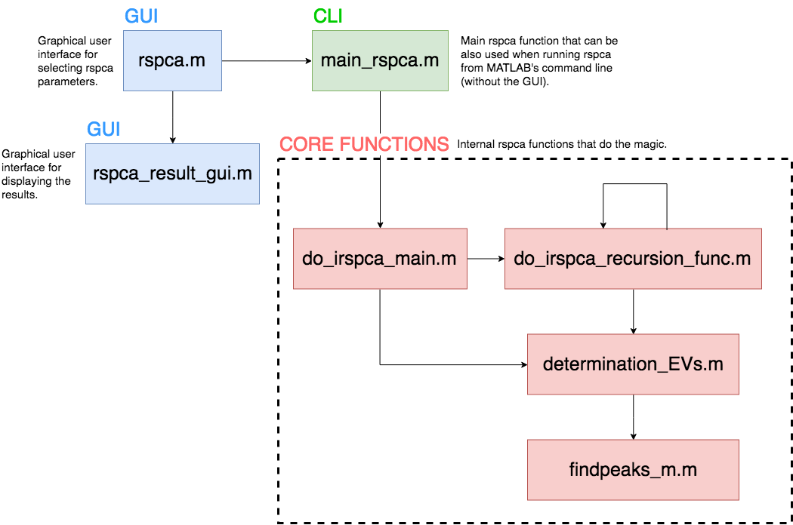

Recursive approach of EEG-segment-based principal component analysis (rsPCA) toolbox for helium-pump artifact removal from EEG data simultaneously acquired with fMRI

Department of Brain and Cognitive Engineering, Korea University
Brain Signal Processing Laboratory, BSPL
 
The rsPCA toolbox is developed to remove helium-pump artifact from EEG data obtained in simultaneous EEG/fMRI acquisition. 
We hope that this toolbox can improve the quality of EEG signal.

Prerequisites: MATLAB (www.mathworks.com) and EEGLAB (sccn.ucsd.edu/eeglab; (Delorme and Makeig, 2004)) should be installed.

Installation: Download the "rspca.zip" file and unzip in a desired directory. 
We would recommend you to follow the tutorial below with the sample data (stored in ../rsPCA/sample_data). one preprocessed sample datasets is provided.

    # helium_epi_off_data.vhdr : EEG data (190 s, 110Hz sampling rate) acquired when helium-pump was on and EPI was off.
      - Ballistocardiogram artifact (BCA) correction was conducted using the blind-source-separation independent component analysis (Liu et al., 2012).

Steps to use the rsPCA toolbox
 
Step 1 - Please add paths of the EEGLAB software and rsPCA toolbox in MATLAB

	>> addpath ../rsPCA -end
	>> addpath ../EEGLAB -end
    
Step 2 - Load an EEG data file via the EEGLAB 

	In the EEGLAB GUI,
	 File >> Import Data >> Using EEGLAB function and plugins >> From Brain Vis. Rec. .vhdr

Step 3 - Open the rsPCA toolbox with the "EEG" variable to analyze (e.g., "EEG" from the EEGLAB)

	>> rspca(EEG)

Step 4 - Please set an output directory to save rsPCA results
 
Step 5 - Please select EEG electrodes that you want to process and set free-parameters (i.e., (1) EEG segment size and (2) percentage threshold level to determine multiple-peaks of eigenvectors)
    
       (1) EEG segment size (i.e., 1s, 2s, and 3s)
         - Three sizes for the EEG segment are provided based on the EEG sampling rate.
       (2) Percentage threshold level (i.e., 1%, 2%, and 3%)
         - Any eigenvectors, whose second peak is above the threshold level from the first-peak, are determined as multiple-peaks. 
 
Step 6 - Click the "Run" button

      A process bar will be displayed. Please wait until the rsPCA process is done.

Step 7 - Click the "Result" button
    
   	 You can see the file list in the left side of the rsPCA result window.
   	 You can see power spectra of the input EEG data ('black') and the rsPCA processed data ('red') by clicking each result file.
	
   ** Tips before running the rsPCA

  	 Please note that 
  	  (1) GA and BCA (via ICA) must be corrected before the rsPCA.
   	  (2) We recommend to use the large EEG segment size (e.g., 330, 440 samples when sampling rate is 110 HZ) to enhance the performance of helium artifact removal.
   	  (3) Approximate computation time (e.g., a single-channel of EEG data recorded for 5 minutes with 110Hz sampling rate): 
             - 20 minutes (220 sample, 2s), 30 minutes (330 samples, 3s), and 40 minutes (440  samples, 4s) 
               using a Windows 7 computer (Intel(R) Core(TM) i7-3770 CPU @ 3.40GHz, 16.0 GB, MATLAB 2009b)
	  (4) If you want to use 250HZ EEG data to remove helium pump artifact, we recommend the following parameters: 
	      - The EEG segment size = 500, Percentage threshold level = 3%. This will be worked, properly. 

Please feel free to contact us (hyunchul_kim@korea.ac.kr), if you have any problems and suggestions.  

Reference

Kim et al., Recursive approach of EEG segment based principal component analysis substantially reduces helium-pump artifacts of EEG data simultaneously acquired with fMRI, NeuroImage 2015, 104: 437-51

